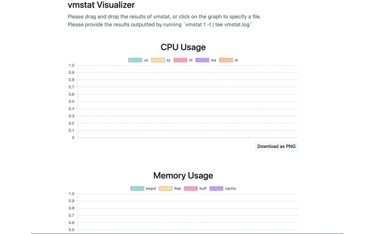

# vmstat Visualizer

  

vmstat Visualizer visualizes the results of vmstat in a graph format. 

##  Features
Automatically generate a graph by dragging and dropping the results of vmstat 1.  
You can also download the graph in PNG.

  

## Usage

You can use from here.

